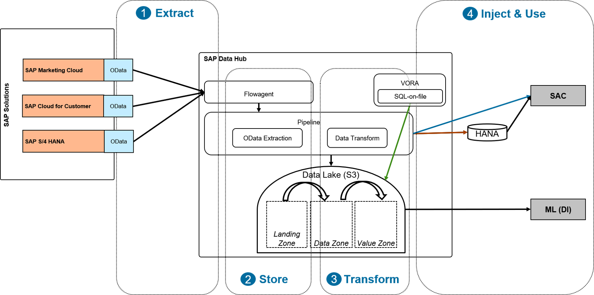

# Application Integration Example Scenario
This scenario exemplifies the use of SAP Data Hub / SAP Data Intelligence to extract, store, transform, and analyse data from several SAP applications in order to create a 360° customer view. For this 360° customer view the scenario provides selected data from SAP Cloud for Customer (customer orders), SAP Marketing Cloud (opportunities and complaints), and SAP S/4 HANA (customer returns) that are usefull to monitor the customer's overall satisfaction and to react on early signs of a loss risk. When using the transformation part in a SAP HANA system the scenario creates under certain conditions a unified customer ID to build a single view of the customer. The scenario can be run as is but of course you can also use it as a template and adapt it to your own requirements.

## Requirements
Before you start using the example, please make sure that:

- You are familiar with the basic concepts of SAP Data Hub Modeling such Pipelines (Graphs), Operators and Dockerfiles.  For more information, you may refer to the Modeling Guide for SAP Data Hub that is available on the SAP Help Portal (https://help.sap.com/viewer/p/SAP_DATA_HUB).
- You are familiar with the basic concepts of SAP Analytics Cloud (https://help.sap.com/viewer/p/SAP_ANALYTICS_CLOUD).
- You are familiar with using SAP Business APIs, in particular OData APIs (https://api.sap.com/).

## Overview
The following picture provides a technical overview of the scenario: 

### Extract
Data is extracted from SAP Marketing Cloud, SAP Cloud for Customer, and SAP S/4 HANA. To ensure maximal compatibility with the current customer landscapes the scenario relies purely on public OData endpoints. The extraction is done via SAP Data Hub pipelines allowing to query the OData interfaces and further process the extracted data.

### Store
The extracted data can be directly injected into SAP HANA and/or stored in the landing zone of a data lake depending on your requirements. The example solution contains pipelines for both scenarios. In the data lake scenario Amazon S3 is used as a storage solution, but this can be easily exchanged with offerings from other cloud storage providers. 

The data lake organisation follows a common data lake architecture pattern in which unprocessed, "raw" data is initially stored in a "landing zone", then cleansed, filtered, joined, etc in the "data zone", and finally aggregated, enriched and provided for analytical consumption in the "value zone". In the example scenario the transitions between the data lake zones are performed by data extraction and transformation pipelines.

### Transform
After the data is stored it can be joined, cleansed, or otherwise transformed. This is an essential step allowing to build a holistic perspective on the extracted data, independently from the source application. This data combination can be done directly in SAP HANA (via SQL views or SAP HANA calcuation views), via SAP Data Hub Data Transform functionality, or the SQL-on-File feature of the SAP Vora database included in SAP Data Hub. The scenario contains SAP HANA content for preparing the data for consumption in SAP Analytics Cloud and a few simple demo pipelines that exemplify data transformations using SQL-on-File and SAP Data Hub Transform operators.

### Analyse
Afterwards the prepared data can be used in multiple ways:
- in SAP Analytics Cloud to visualize reports & dashboards
- via SQL-on-file the data located in S3 can be accessed via SQL command
- for further processing in machine learning scenarios

The scenario contains SAP Analytics Cloud content for producing a 360° customer view dashboard. SQL-based analyses of the data that resides in a data lake can be done following the example of the SQL-on-File demo pipeline.
 
By intention a mixture of different technologies (e.g. storing in CSV, Parquet, ORC format) and consumption paths are used to showcase different options for realizing the scenario.

## Detailed Description

- [Implementing the scenario](doc/HowToImplement.md)
- [Extracting data from source systems](doc/HowToExtract.md)
- [Transforming data](doc/HowToTransform.md)
- [Analysing data in SAP Analytics Cloud](doc/HowToAnalyse.md)
