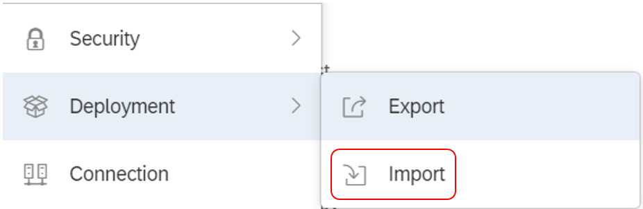
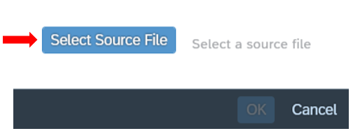
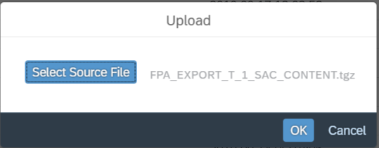
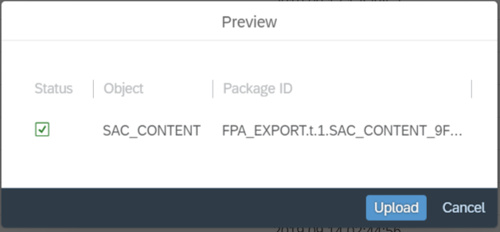
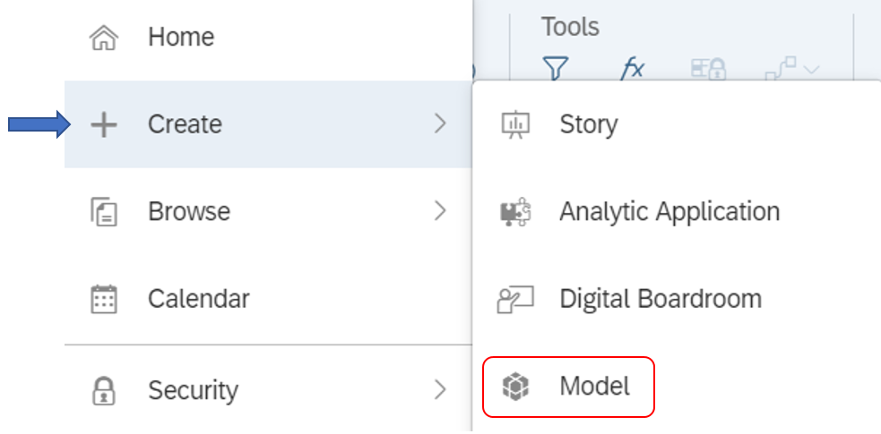
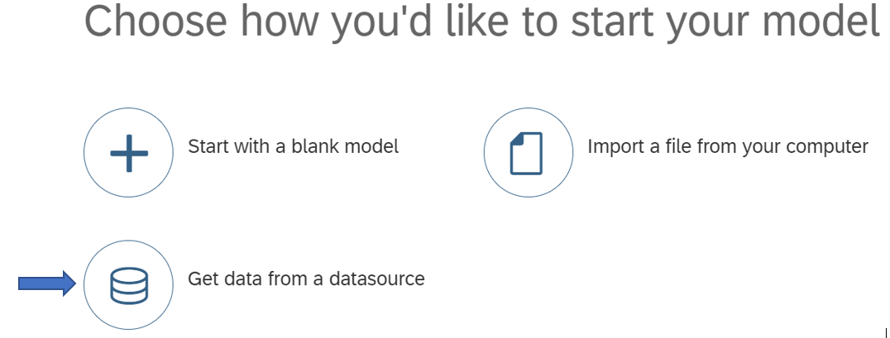
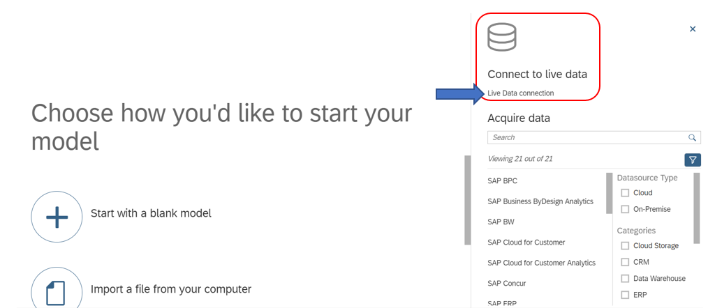
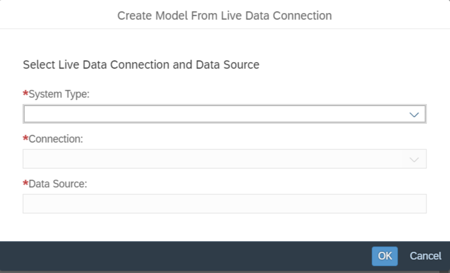

# Analysing data in SAP Analytics Cloud

## How to import content from a .tgz file in order to recreate the pre-built stories

First of all, download the .tgz package from GitHub to your computer.

Open SAC and choose the Deployment window from the drop-down menu on the top-left corner. Click on Import.

1.	In the Import window, choose Upload.

2.	In the Upload dialog, select Upload from Local File, choose Select Source File, and browse for the file you want to upload.

3.	Select OK.

4.	In the Preview dialog, check that the file is what you want to upload, and then choose Upload.

A New window opens that lists the content of the upload. For example, a KPI upload contains data on the affected dimensions, model, and story.

5.	If required, amend the import by selecting or deselecting the checkboxes for the listed content.

6.	Choose the Import icon and select options for overwriting data during the import.

If an object selected for import does not exist on your system, the object will be created and its data will be imported. For objects that already exist in your system, your selections in the Options window determine whether to overwrite the object and update its data. By default, existing objects will not be updated or overwritten.

## How to create live data connections and stories in SAP Analytics Cloud

The creation of Live Data Connections to SAP HANA is described [here](https://help.sap.com/doc/00f68c2e08b941f081002fd3691d86a7/2019.16/en-US/cc03773d7f554c4ebc9e29b4c2792e26.html).

Once the desired Calc Views are created in SAP HANA you need to mirror them in SAP Analytics Cloud. This is done by creating a new model:

### Step 1

### Step 2

### Step 3

### Step 4

