# Extracting data from source systems

This section covers how to
- prepare SAP HANA for [data extraction](#preparing-sap-hana-for-data-extraction)
- extract data from source systems [to SAP HANA](#extracting-data-from-source-systems-to-sap-hana)
- extract data from source systems [to Amazon S3](#extracting-data-from-source-systems-to-amazon-s3)

## Preparing SAP HANA for data extraction
Below you will find several pipelines that fill target tables in your HANA system. Basically a data extraction pipeline can automtically create a target table in a HANA system if it is configured accordingly but, here, we create the tables in the HANA system by an import of table definitions before the pipelines are executed. The main reason for that is that the also delivered transformation views require that all tables shown in the picture below are present in the HANA system even when you use only some of the pipelines.

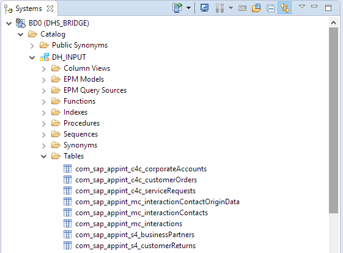

Read how to [create the complete set of SAP HANA import target tables](hanaHowToImportTargetTables.md) from the repository.

-> [back to top](#extracting-data-from-source-systems)

## Extracting data from source systems to SAP HANA
The graphs in this section perform a complete initial load of the source data. There is no delta handling since this is not supported by the OData V2 APIs that are used throughout the scenario. 

If you want to extract the complete set of source data from SAP Cloud for Customer, SAP Marketing Cloud, and SAP S/4 HANA you can simply execute the `OData to HANA` workflow pipeline. It runs the appropriate individual extraction graphs in one go. Check the Terminal operator's UI for error messages. In case errors have occurred press `Enter` on the Terminal console to stop the graph.

Short name: `OData to HANA` <br>
ID: [`com.appInt.odata2hana`](../src/content/files/vflow/graphs/com/appInt/odata2hana/graph.json)

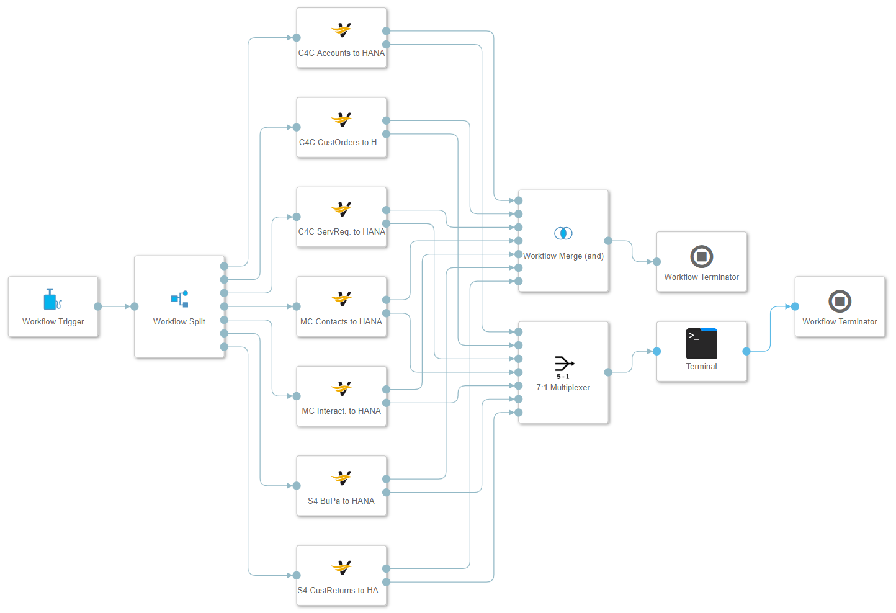

Alternatively, you can also execute the individual extraction graphs depending on your requirements. These are described in the following sections.

-> [back to top](#extracting-data-from-source-systems)

### SAP Marketing Cloud `Contact Orgin Data` to SAP HANA

Short name: `MC Contcts To HANA`  
ID: [`com.appInt.odata2hana.mc.loadContactOriginData`](../src/content/files/vflow/graphs/com/appInt/odata2hana/mc/loadContactOriginData/graph.json)    
  
This graph extracts SAP Marketing Cloud interaction contact origin data and stores them directly to SAP HANA.

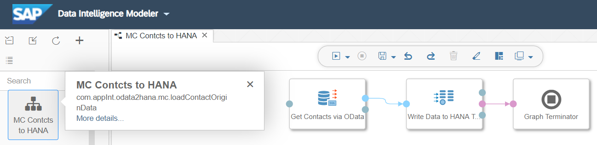

Read the graph documentation [here](../src/content/files/vflow/graphs/com/appInt/odata2hana/mc/loadContactOriginData/README.md).

-> [back to top](#extracting-data-from-source-systems)

### SAP Marketing Cloud `Interactions` to SAP HANA

Short name: `MC Interact. to HANA`  
ID: [`com.appInt.odata2hana.mc.loadInteractions`](../src/content/files/vflow/graphs/com/appInt/odata2hana/mc/loadInteractions/graph.json)    
  
This graph extracts SAP Marketing Cloud interactions and stores them directly to SAP HANA.

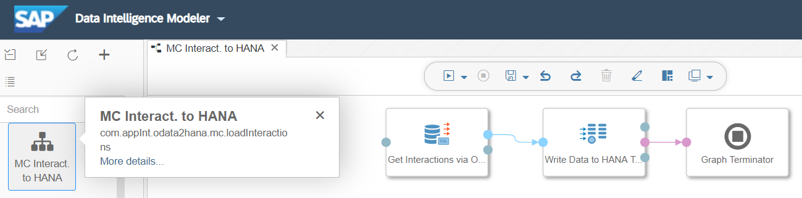

Read the graph documentation [here](../src/content/files/vflow/graphs/com/appInt/odata2hana/mc/loadInteractions/README.md).

-> [back to top](#extracting-data-from-source-systems)

### SAP Cloud for Customer `Corporate Accounts` to SAP HANA

Short name: `C4C Accts. to HANA`  
ID: [`com.appInt.odata2hana.c4c.loadCorporateAccounts`](../src/content/files/vflow/graphs/com/appInt/odata2hana/c4c/loadCorporateAccounts/graph.json)    
    
This graph extracts corporate accounts from SAP Cloud for Customer and stores them directly to SAP HANA.


Read the graph documentation [here](../src/content/files/vflow/graphs/com/appInt/odata2hana/c4c/loadCorporateAccounts/README.md).

-> [back to top](#extracting-data-from-source-systems)

### SAP Cloud for Customer `Customer Orders` to SAP HANA
  
Short name: `C4C CustOr to HANA`  
ID: [`com.appInt.odata2hana.c4c.loadCustomerOrders`](../src/content/files/vflow/graphs/com/appInt/odata2hana/c4c/loadCustomerOrders/graph.json)   
    
This graph extracts customer orders from SAP Cloud for Customer and stores them directly to SAP HANA.


Read the graph documentation [here](../src/content/files/vflow/graphs/com/appInt/odata2hana/c4c/loadCustomerOrders/README.md).

-> [back to top](#extracting-data-from-source-systems)

### SAP Cloud for Customer `Service Requests` to SAP HANA

Short name: `C4C SrvRq. to HANA`  
ID: [`com.appInt.odata2hana.c4c.loadServiceRequests`](../src/content/files/vflow/graphs/com/appInt/odata2hana/c4c/loadServiceRequests/graph.json)   
  
This graph extracts service requests from SAP Cloud for Customer and stores them directly to SAP HANA.


Read the graph documentation [here](../src/content/files/vflow/graphs/com/appInt/odata2hana/c4c/loadServiceRequests/README.md).

-> [back to top](#extracting-data-from-source-systems)

### SAP S/4 HANA `Business Partners` to SAP HANA

Short name: `S4 BuPa to HANA`  
ID: [`com.appInt.odata2hana.s4.loadBusinessPartners`](../src/content/files/vflow/graphs/com/appInt/odata2hana/s4/loadBusinessPartners/graph.json)   
  
This graph extracts business partners from SAP S/4 HANA and stores them directly to SAP HANA.

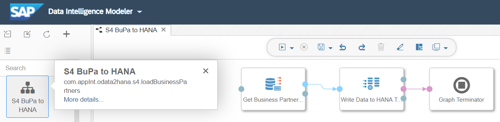

Read the graph documentation [here](../src/content/files/vflow/graphs/com/appInt/odata2hana/s4/loadBusinessPartners/README.md).

-> [back to top](#extracting-data-from-source-systems)

### SAP S/4 HANA `Customer Returns` to SAP HANA

Short name: `S4 CustRet. to HANA`  
ID: [`com.appInt.odata2hana.s4.loadCustomerReturns`](../src/content/files/vflow/graphs/com/appInt/odata2hana/s4/loadCustomerReturns/graph.json)   
  
This graph extracts customer returns from SAP S/4 HANA and stores them directly to SAP HANA.

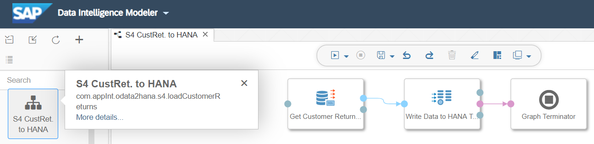

Read the graph documentation [here](../src/content/files/vflow/graphs/com/appInt/odata2hana/s4/loadCustomerReturns/README.md).

-> [back to top](#extracting-data-from-source-systems)

## Extracting data from source systems to Amazon S3
The graphs in this section perform a complete initial load of the source data. There is no delta handling since this is not supported by the OData V2 APIs that are used throughout the scenario. 

If you want to extract the complete set of source data from SAP Cloud for Customer, SAP Marketing Cloud, and SAP S/4 HANA you can simply execute the `OData to S3` workflow pipeline. It runs the appropriate individual extraction graphs in one go. Check the Terminal operator's UI for error messages. In case errors have occurred press `Enter` on the Terminal console to stop the graph.

Short name: `OData to S3` <br>
ID: [`com.appInt.odata2s3`](../src/content/files/vflow/graphs/com/appInt/odata2s3/graph.json)

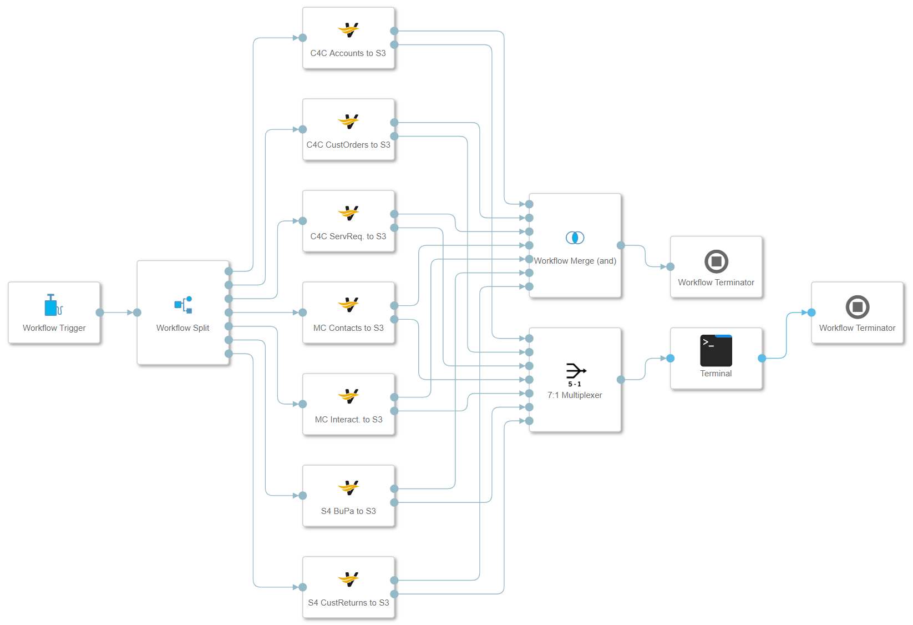

Alternatively, you can also execute the individual extraction graphs depending on your requirements. These are described in the following sections.

The graphs extract the source data into CSV, ORC, and Parquet files on the connected Amazon S3 storage service. The extraction will create the following folder structure:
```
sdl
|
+-- landing_zone
    |
    +-- appInt
        |
        +-- c4c
        |
        +-- mc
        |
        +-- s4
```
Folders that are not already present will be created on the fly by running the graphs.

If you want to extract the data into a different folder structure you need to modify the `S3 file name` configuration of the `Flowagent File Producer` operator accordingly.

-> [back to top](#extracting-data-from-source-systems)

### SAP Marketing Cloud `Contact Origin Data` to Amazon S3

Short name: `MC Contcts to S3`  
ID: [`com.appInt.odata2s3.mc.loadContactOriginDataORC`](../src/content/files/vflow/graphs/com/appInt/odata2s3/mc/loadContactOriginDataORC/graph.json)   
  
This graph extracts SAP Marketing Cloud contact data and stores them in ORC format into Amazon S3.

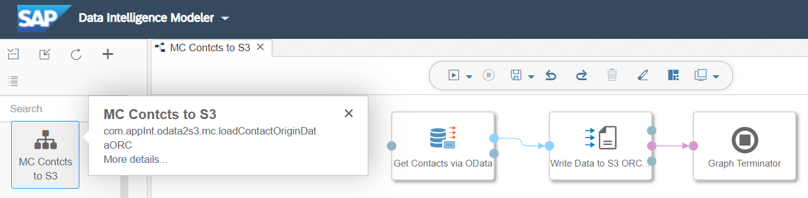

Read the graph documentation [here](../src/content/files/vflow/graphs/com/appInt/odata2s3/mc/loadContactsORC/README.md).

-> [back to top](#extracting-data-from-source-systems)

### SAP Marketing Cloud `Interactions` to Amazon S3

Short name: `MC Interact. to S3`  
ID: [`com.appInt.odata2s3.mc.loadInteraactionsORC`](../src/content/files/vflow/graphs/com/appInt/odata2s3/mc/loadInteraactionsORC/graph.json)   
  
This graph extracts SAP Marketing Cloud interaction data and stores them in ORC format into Amazon S3.

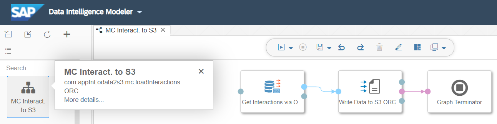

Read the graph documentation [here](../src/content/files/vflow/graphs/com/appInt/odata2s3/mc/loadInteractionsORC/README.md).

-> [back to top](#extracting-data-from-source-systems)

### SAP Cloud for Customer `Corporate Accounts` to Amazon S3

Short name: `C4C Accts. to S3`  
ID: [`com.appInt.odata2s3.c4c.loadCorporateAccountsCSV`](../src/content/files/vflow/graphs/com/appInt/odata2s3/c4c/loadCorporateAccountsCSV/graph.json)   
  
This graph extracts SAP Cloud for Customer account data and stores them in CSV format into Amazon S3.

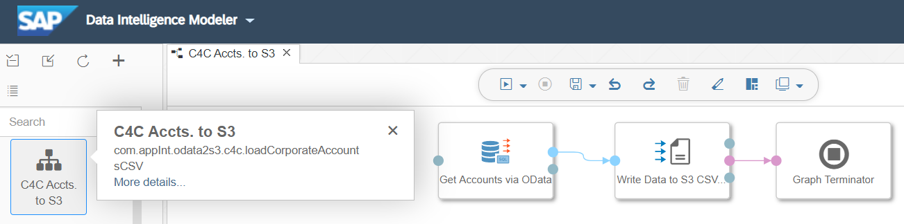

Read the graph documentation [here](../src/content/files/vflow/graphs/com/appInt/odata2s3/c4c/loadAccountsCSV/README.md).

-> [back to top](#extracting-data-from-source-systems)

### SAP Cloud for Customer `CustomerOrders` to Amazon S3

Short name: `C4C CustOr to S3`  
ID: [`com.appInt.odata2s3.c4c.loadCustomerOrdersCSV`](../src/content/files/vflow/graphs/com/appInt/odata2s3/c4c/loadCustomerOrdersCSV/graph.json)    
  
This graph extracts SAP Cloud for Customer customer order data and stores them in CSV format into Amazon S3.

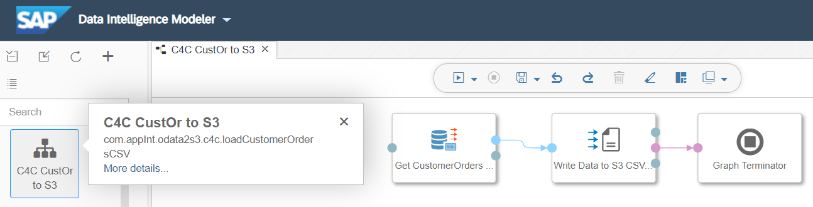

Read the graph documentation [here](../src/content/files/vflow/graphs/com/appInt/odata2s3/c4c/loadCustomerOrdersCSV/README.md).

-> [back to top](#extracting-data-from-source-systems)

### SAP Cloud for Customer `ServiceRequests` to Amazon S3

Short name: `C4C SrvRq. to S3`  
ID: [`com.appInt.odata2s3.c4c.loadServiceRequestsParquet`](../src/content/files/vflow/graphs/com/appInt/odata2s3/c4c/loadServiceRequestsParquet/graph.json)   
  
This graph extracts SAP Cloud for Customer service request data and stores them in Parquet format into Amazon S3.

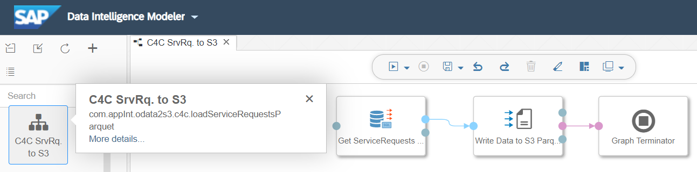

Read the graph documentation [here](../src/content/files/vflow/graphs/com/appInt/odata2s3/c4c/loadServiceRequestsParquet/README.md).

-> [back to top](#extracting-data-from-source-systems)

### SAP S/4 HANA `BusinessPartners` to Amazon S3

Short name: `S4 BuPa to S3`  
ID: [`com.appInt.odata2s3.s4.loadBusinessPartnersParquet`](../src/content/files/vflow/graphs/com/appInt/odata2s3/s4/loadBusinessPartnersParquet/graph.json)   
  
This graph extracts S/4 business partner data and stores then in Parquet format into Amazon S3.

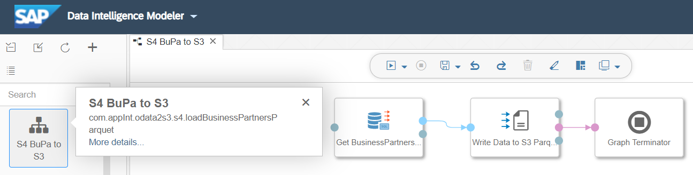

Read the graph documentation [here](../src/content/files/vflow/graphs/com/appInt/odata2s3/s4/loadBusinessPartnersParquet/README.md).

-> [back to top](#extracting-data-from-source-systems)

### SAP S/4 HANA `CustomerReturns` to Amazon S3

Short name: `S4 CustRet. to S3`  
ID: [`com.appInt.odata2s3.s4.loadCustomerReturnsCSV`](../src/content/files/vflow/graphs/com/appInt/odata2s3/s4/loadCustomerReturnsCSV/graph.json)   
  
This graph extracts S/4 customer returns data and stores then in CSV format into Amazon S3.

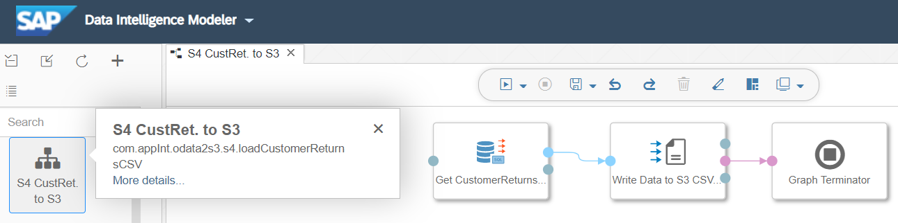

Read the graph documentation [here](../src/content/files/vflow/graphs/com/appInt/odata2s3/s4/loadCustomerReturnsCSV/README.md).

-> [back to top](#extracting-data-from-source-systems)
