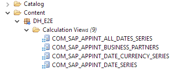
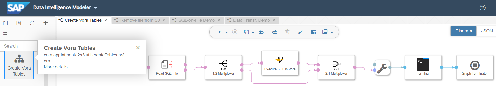
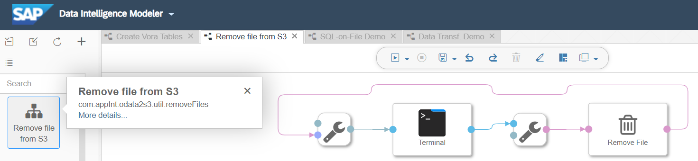
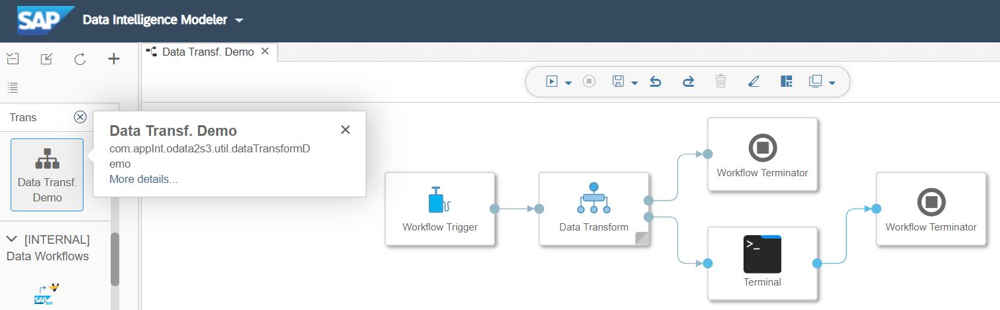

# Transforming data

## How to create views and calculation views in SAP HANA

### Required privileges and settings
Equip your user with the privileges that are required for creating a calculation view in SAP HANA Studio:
- Log on with your user and create the `DH_INPUT` landing schema.
  - Allow other users to access the schema:
    1. With your user open `security` -> `users` -> `(userId)` - `Object Privileges`.
    2. Add catalog object: search for the landing schema and select it.
    3. Assign all privileges for the schema to the user.
   
  - In this landing schema, the imported data will later be inserted.
  
 - Log on as system user and assign the following rights and privileges to the users:
  - Granted Roles:
    - `CONTENT_ADMIN`
    - `MODELING`
    - `MONITORING`
    - `sap.bc.ina.service.v2.userRole::INA_USER` (for SAP Analytics Cloud access)
  
  - System Privileges:
    - `IMPORT`
    - `REPO.IMPORT`
  
  - Object Privileges:
    - `_SYS_BI` with all privileges that can be assigned
    - `_SYS_BIC` with all privileges that can be assigned
  
  - Analytical Privileges:
    - `_SYS_BI_CP_ALL`
  
- Log on with you user and enable the schema `_SYS_REPO` to access the `DH_INPUT` schema where your input data will be located that is used in the calculation views. This is required because the activation of the calc view generates artifacts in the `_SYS_REPO` schema that provide the data from the landing schema.
  - Open a SQL editor in the SAP HANA studio (with your user connection) and execute the following command:

    `GRANT SELECT ON SCHEMA DH_INPUT TO _SYS_REPO WITH GRANT OPTION`

-> [back to top](#transforming-data)

### Import views and calculation views

The application integration example scenario comes with several HANA data base and calculation views that transform the previously imported data into time series. These time series provide the counts and total amounts of the business transactions from the various source systems in one consistent picture per business partner. For the consumptions of these time series by SAP Analytics Cloud the following four calculation views are provided that can be used to present the time series in SAP Analytics Cloud:

How to [import HANA calculation views](hanaHowToImportViewsForCockpit.md) for SAP Analytics Cloud from the repository.

-> [back to top](#transforming-data)

## Working with file data
As an alternative to loading the data into the SAP HANA in-memory database you may want to work with data files stored in a cost-effective cloud storage. SAP Data Hub provides the option to [work with file data using SQL statements](https://help.sap.com/viewer/e8d3e271a4554a35a5a6136d3d6af3f8/2.6.latest/en-US/65e010186f4e423f9199982c7db4122d.html). In this way you can leverage the powerfull genericity of SQL to perform data analyses directly on your file storage.

### Create Vora Tables from SQL File

Short name: `Create Vora Tables`  
ID: [`com.appInt.odata2s3.util.createTablesInVora`](../src/content/files/vflow/graphs/com/appInt/odata2s3/util/createTablesInVora/graph.json) 

This is a helper graph which creates the required structures in Vora to use SQL-on-file. It only needs to be executed once.

Read the graph documentation [here](../src/content/files/vflow/graphs/com/appInt/odata2s3/util/createTablesInVora/README.md).

-> [back to top](#transforming-data)

### Remove file from S3

Short name: `Remove file from S3`  
ID: [`com.appInt.odata2s3.util.removeFiles`](../src/content/files/vflow/graphs/com/appInt/odata2s3/util/removeFiles/graph.json) 

This is a helper graph that allows you to delete files and directories from Amazon S3.

Read the graph documentation [here](../src/content/files/vflow/graphs/com/appInt/odata2s3/util/removeFiles/README.md).

-> [back to top](#transforming-data)

### SQL-on-File Demo

Short name: `SQL-on-File Demo`  
ID: [`com.appInt.odata2s3.util.sqlOnFileDemo`](../src/content/files/vflow/graphs/com/appInt/odata2s3/util/sqlOnFileDemo/graph.json) 

This graph shows how to access the data stored in Amazon S3 via SQl-on-files. As an example a simple join of two data sets is performed.

Read the graph documentation [here](../src/content/files/vflow/graphs/com/appInt/odata2s3/util/sqlOnFileDemo/README.md).

-> [back to top](#transforming-data)

### Data Transform Workflow Demo

Short name: `Data Transf. Demo`  
ID: [`com.appInt.odata2s3.util.dataTransformDemo`](../src/content/files/vflow/graphs/com/appInt/odata2s3/util/dataTransformDemo/graph.json) 

This graph shows how to access the data stored in Amazon S3 using the `Data Transform` operator. As an example a simple join of two data sets is performed.

Read the graph documentation [here](../src/content/files/vflow/graphs/com/appInt/odata2s3/util/dataTransformDemo/README.md).

-> [back to top](#transforming-data)
