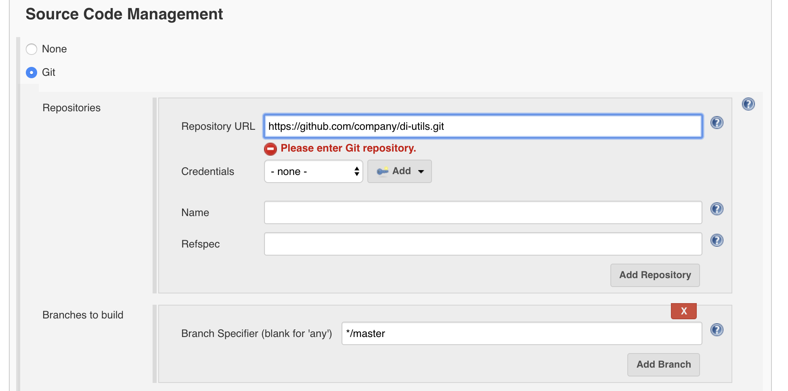
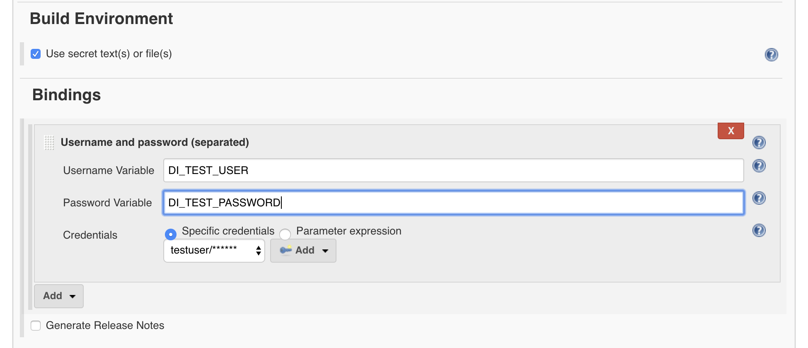
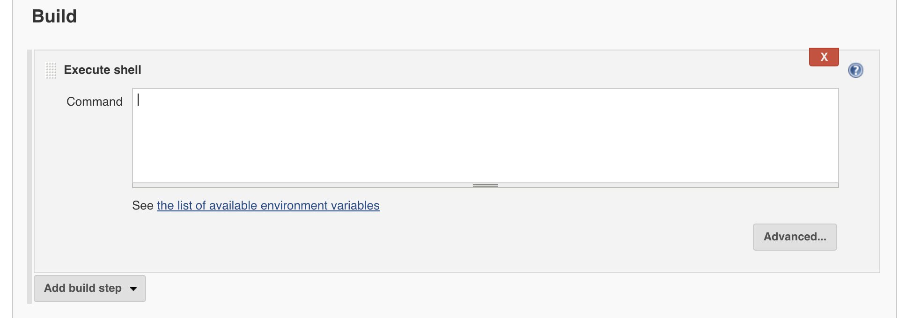

# Continuous Integration and Delivery with SAP Data Intelligence

In this guide we explain how to setup a [Continuous Integration and Delivery (CI/CD) pipeline](https://en.wikipedia.org/wiki/Continuous_integration) for solution development with [SAP Data Intelligence (SAP DI)](https://www.sap.com/products/data-intelligence.html). See the [overview](Readme.md#overview) section for a high-level overview of the CI/CD process.

As shown in the [GitWorkflow](GitWorkflow.md) guide, we expect that the solution is tracked in a Git repository.

We make use of the [System Management Command-Line Client (vctl)](https://help.sap.com/viewer/41b069490705457e9426b112a3f052bd/Cloud/en-US)
to implement the CI/CD steps. For demonstration, we use a [Jenkins](https://jenkins.io/) build server with
shell build steps to implement the build phases. However, other build servers can equally be used
to implement the needed steps using the `vctl` tool.

## Jenkins Setup

We assume you have a Jenkins server and have permissions to create a new build project.
The Jenkins server need to be able to connect to the following services:

* The SAP Data Intelligence gateway (address shown when opening the launchpad)
* The Git server hosting your repository

The Jenkins workers need to have the following software installed:

* `Python2` or `Python3` (needed to parse JSON response messages)
* `curl` (needed to communicate with the the SAP Data Intelligence Pipelines REST API)
* `vctl` (needed to communicate with SAP Data Intelligence Systems Management)


## Dockerized Jenkins (for Testing)

For testing your [build jobs](#jenkins-build-job), the following Docker container will
provide a Jenkins server with all needed dependencies. You will need to have
the `vctl` binary (linux) in the docker build path.

```
FROM jenkinsci/blueocean

USER root

RUN apk update \
    && apk add --no-cache linux-headers \
    && apk add --no-cache build-base \
    && apk add --no-cache zip \
    && apk add --no-cache python

COPY vctl /root/vctl

RUN chmod 777 root
ENV PATH="/root:${PATH}"
```

You can build the docker image as follows:

```
docker build -t di-jenkins:latest .
```

The image can then be started as follows:

```
docker run -u root -d -p 8080:8080 -p 50000:50000 -v /tmp/jenkins-data:/var/jenkins_home di-jenkins
```

You can now access Jenkins in your browser under `http://localhost:8080/` and will
need to enter the inital password provided in the file `/tmp/jenkins-data/secrets/initialAdminPassword `
on your local machine.

When starting the image the first time, make sure to install the "Credentials Bindings" plugin.

## Jenkins Build Job

The following steps will configure a build job that is able to fetch, bundle, install,
and test a Git solution tracked in a Git repository:

* Create a new project of type `Freestyle Project`
* Add your Repository URL and the credentials under `Source Code Management`



* Activate the `GitHub hook trigger for GitScm polling` under `Build Triggers`
* To trigger your GitHub Repository you need to setup a GitHub trigger as described in [this article](https://dzone.com/articles/adding-a-github-webhook-in-your-jenkins-pipeline)
* Under `Build Environment` activate `Delete workspace before build starts`
* We will register user and password information in the secret store. For this you have to tick `Use secret text(s) or file(s)`
* In the Bindings you can now add the parameters for `DI_TEST_USER` and `DI_TEST_PASSWORD` (these are the credentials for the user on
  the test tenant)




* Add a `shell` build step for the `bundle` phase



* Copy the content of the [./scripts/bundle-solution.sh](./scripts/bundle-solution.sh) script into the text area.

* Add another `shell` build step for the `install` phase
* Copy the content of the [./scripts/install-solution.sh](./scripts/install-solution.sh) script into the text area.
* You will need to configure the `DI_URL` and `DI_TEST_TENANT` parameters. **Note**: The `DI_TEST_USER`
and `DI_TEST_PASSWORD` parameters will be provided as environment variables from the secret binding.

* Add another `shell` build step for the `test` phase
* Copy the content of the [./scripts/test-pipeline.sh](./scripts/test-pipeline.sh) script into the text area.
* You will need to configure the `DI_URL`, the `DI_TEST_TENANT`, and the `DI_TEST_GRAPH` parameters. **Note**: The `DI_TEST_USER`
and `DI_TEST_PASSWORD` parameters will be provided as environment variables from the secret binding.
* You can now run the Jenkins project manually for a first test. The console output of
a successful execution looks as follows:

```
Started by user The Super Admin
Running as SYSTEM
Building in workspace /var/jenkins_home/workspace/dh-solution-1
[WS-CLEANUP] Deleting project workspace...
[WS-CLEANUP] Deferred wipeout is used...
[WS-CLEANUP] Done
using credential DUSER
Cloning the remote Git repository
Cloning repository git@github.wdf.sap.corp:d064440/dh-starter-project.git
 > git init /var/jenkins_home/workspace/dh-solution-1 # timeout=10
...
 > git rev-list --no-walk da492cca9a7355ca00cb0fa0a196e738bf9eb2f7 # timeout=10
[dh-solution-1] $ /bin/bash /tmp/jenkins5742343554534570453.sh
-----------------------
@@ Building solution @@
-----------------------
  adding: manifest.json (deflated 4%)
  adding: content/ (stored 0%)
  adding: content/files/ (stored 0%)
  adding: content/files/vflow/ (stored 0%)
  adding: content/files/vflow/graphs/ (stored 0%)
  adding: content/files/vflow/graphs/com/ (stored 0%)
  adding: content/files/vflow/graphs/com/sap/ (stored 0%)
  adding: content/files/vflow/graphs/com/sap/starter/ (stored 0%)
  adding: content/files/vflow/graphs/com/sap/starter/dummy-graph/ (stored 0%)
  adding: content/files/vflow/graphs/com/sap/starter/dummy-graph/graph.json (deflated 67%)
-------------------------
@@ Installing Solution @@
-------------------------
- Sys login...
Successfully logged in as "system/system"
- Stopping apps for 'default/admin'
- Removing existing solution 'dh-starter-project-1.0.1' from strategy 'strat-default-1911.1.8'...
- Adding new solution 'dh-starter-project-1.0.1' to strategy 'strat-default-1911.1.8'...
dh-starter-project-1.0.1
----------------------
@@ Testing Solution @@
----------------------
- Dev login...
Successfully logged in as "default/admin"
- Starting Pipeline Modeler...
- Running test graph 'com.sap.starter.dummy-graph' ...
  - Checking graph status (try 1/20)...
  - Checking graph status (try 2/20)...
  - Checking graph status (try 3/20)...
  - Checking graph status (try 4/20)...
  - Checking graph status (try 5/20)...
- Deleting graph '87120c9a5bdf467cac51c5ddc82a9881'...
Graph execution succeeded!
```

## Summary

This guide showed how to setup a CI/CD pipeline to build and test
a solution tracked in a Git repository. The guide should provide a template
for other customized CI/CD setups in enterprise environments.

Feel free to send us feedback and open bugs in case of problems. We will update
the guides as new SAP Data Intelligence versions are published.
