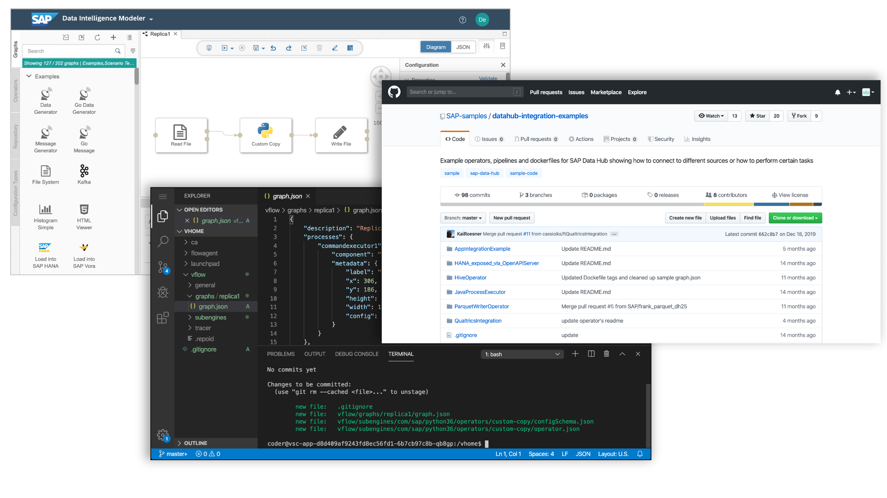
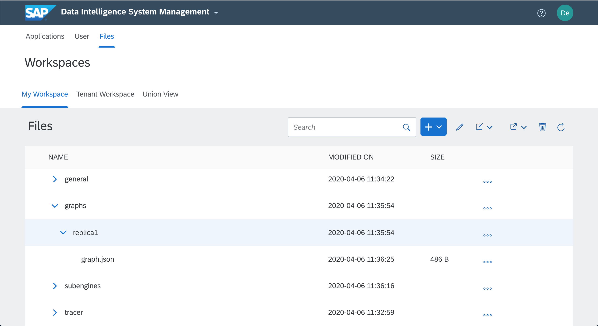
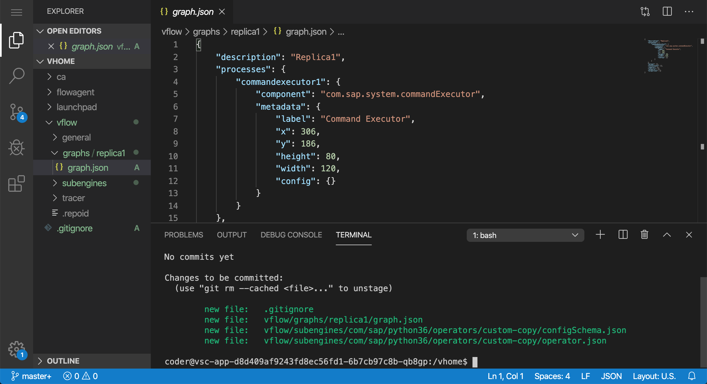

# Git Workflow for SAP Data Intelligence

With [SAP Data Intelligence (SAP DI)](https://www.sap.com/products/data-intelligence.html) you can use Git repositories for solution development. This guide explains the fundamentals and the necessary steps to establish a Git development workflow with SAP Data Intelligence.



## Solution Development

Knowing the following concepts to develop solutions with SAP Data Intelligence simplifies the implementation of the Git workflow. You can jump to the [Git Workflow](#git-workflow) section in case you are already familiar with the fundamental concepts.

### Solution

In SAP Data Intelligence a `solution` represents a package of graphs, operators, or other artifacts that can be installed on a tenant.

The structure of a solution looks as follows:

```
<my-replica-solution>/                                # Parent folder (not part of the solution)
  content/                                            # Folder for artifacts
  content/vflow/graphs/replica1/graph.json            # Example graph artifact
  content/vflow/operators/custom-copy/operator.json   # Example operator artifact
  manifest.json                                       # Solution meta-data
```

The files of a solution are zipped into a transportable package in order to install them on a tenant. E.g., the files above will be zipped into the file `my-replica-solution.zip` like this:

```bash
cd my-replica-solution/
zip -r my-replica-solution.zip manifest.json content/
```

If you have access to the [System Management Command-Line Client (vctl)](https://help.sap.com/viewer/41b069490705457e9426b112a3f052bd/Cloud/en-US) the packaging can be simplified as follows:

```bash
vctl solution bundle my-replica-solution/
```

The `name` and `version` of a solution are specified in the `manifest.json` file (not by the file name of the zip package).
These values specify how the `layer` is shown on the SAP DI tenant. The structure of the file looks like:

```
{
  "name":"my-replica-solution",
  "version":"1.0.0",
  "format":"2",
  "dependencies":[]
}
```

When installing a solution, the content folder of the solution is copied to a `layer` in a layered file-system. The layer can then be added to a `strategy` to make the content available to all processes and applications running on the tenant. See the [Manage Strategies](https://help.sap.com/viewer/ca509b7635484070a655738be408da63/Cloud/en-US/8bbc552fc0604792bb114d850391d739.html) section in the [Administration Guide](https://help.sap.com/viewer/ca509b7635484070a655738be408da63/Cloud/en-US) for more information.

### User Workspace

Each user of SAP Data Intelligence has an dedicated workspace for his development artifacts (graphs, operators, etc.). The files in the user workspace can be shown in the `System Management` application under the `files` tab:



These files are also available for all applications that are running on SAP DI. Internally, they
are stored in the `vhome` folder of the application containers:

```
/vhome/
/vhome/vflow/graphs/replica1/graph.json
/vhome/vflow/operators/custom-copy/operator.json
```

The folder is only visible to the user. The user is able to create, modify, and remove files in this folder by using the SAP DI applications (e.g., [SAP Data Intelligence Pipeline Modeler](https://help.sap.com/viewer/1c1341f6911f4da5a35b191b40b426c8/Cloud/en-US)) or directly in the `/vhome` folder. Applications like the [System Management](https://help.sap.com/viewer/ca509b7635484070a655738be408da63/Cloud/en-US/76e7a1faa64f408e9e72dc2fa4071964.html) or the [VSCode Application](vscode-app/Readme.md) make this folder available for editing to the user.

### Development Process without Git

Without using Git, the user will use the following workflow to develop a solution of graphs and operators:

1. Import solution into the user workspace
2. Modify graphs and operators using the SAP Data Intelligence Pipeline Modeler
3. Export files from user workspace as a solution (name and version parameters needs to be provided during export)

## Git Workflow

We now show a workflow where the files of a solution are tracked in a Git repository. Thereby, we connect the user workspace (`/vhome`) to a Git repository and develop a single solution in the workspace at a time. Multiple users can work on the same solution in their own user workspaces and publish code changes to Git using commit/push.

The workflow at-a-glance looks like this:

1. Connect the user workspace to the Git repository and create the solution meta-data file (once for each solution)
2. Pull changes from the Git repository into the user workspace
3. Modify graphs and operators using SAP DI (e.g., the SAP Data Intelligence Pipeline Modeler)
3. Add, commit, and push changes to the Git repository

### Pre-requisites

* Install the [VSCode Application](vscode-app/Readme.md) on the tenant
* Make sure the developers can see the application in their launchpad
* As a developer, open the VSCode Application and open a new terminal (all commands shown below are executed using the terminal in the `/vhome` path)



### Connect the user workspace to the Git repository

If you decide to develop a solution using Git, you need to make the `/vhome` folder the
root path of the Git repository. We assume the git repository is available
under `<repository-url>`. Then, the following steps need to be executed in the VSCode terminal:

```bash
# in /vhome folder
git init
git remote add origin <repository-url>
```

Now you can fetch the changes from the remote repository
(you will be asked for username and password):

```bash
git fetch origin
```

Depending on the used Git repository, you may also need to specify the following information:

```bash
git config --global user.email "you@example.com"
git config --global user.name "Your Name"
```

### Create Solution Manifest

In case you connected to an empty Git repository, you need to create the necessary
solution manifest file first. In case you want to checkout and existing solution,
you can skip these steps.

Create a `manifest.json` file and add it to the repository:

```json
{
  "name":"solution-name",
  "version":"0.0.1",
  "format": "2",
  "dependencies":[]
}
```

Add the file to the repository:

```bash
git add manifest.json
```

For convenience, you should add a `.gitignore` file such that runtime files and
folder are not shown as git artifacts. Add the following patterns to the `.gitignore` file:

```
flowagent/
ca/
dex/
launchpad/
vflow/general/
vflow/subdevkits/
vflow/var/
vflow/.repoid
*.pyc
__pycache__/
```

Add the `.gitignore` file to the repository:

```bash
git add .gitignore
```

You may now push these changes to the repository. For this, create a commit
out of the two added files and push it to the repository:

```bash
git commit -m "Initial solution meta-data"
```

Push the commit to a branch in your repository (here, `replica1`). You may be asked for username and password:
```bash
git push origin replica1
```

The output of the command will look as follows:
```
Username for 'https://github.com': user1
Password for 'https://user1@github.com':
Counting objects: 2, done.
Delta compression using up to 8 threads.
Compressing objects: 100% (3/3), done.
Writing objects: 100% (4/4), 476 bytes | 36.00 KiB/s, done.
Total 4 (delta 0), reused 0 (delta 0)
remote:
remote: Create a pull request for 'replica1' on GitHub by visiting:
remote:      https://github.com/user1/replication-solution/pull/new/replica1
remote:
To https://github.com/user1/replication-solution.git
 * [new branch]      replica1 -> replica1
```

### Checkout Existing Solution

In case you want to work with an already existing solution, you can execute the
following commands:

```bash
git checkout <branch>
```

In case you already checked out the branch and just want to get the latest changes,
execute:

```bash
git pull
```

### Commit and Push Changes

Once you do changes to the graphs, operators, or other artifacts you will see the
changes using the `git status` command. You can now selectively add the changes using

```
git add <filename>
```

Once you added all changes you can commit them using

```
git commit [-m "<commit message>"]
```

**Note**: The VSCode application has `vim` configured as the default editor to enter
the commit message.

Once the commit is created, you can push the changes to the repository using:

```
git push
```

### Switch Repository

To use another repository you have the following options:

1. Add a new remote source to the local repository (see above) and checkout a branch from there.
2. Execute `git clean` and remove the `.git` folder. Connect to a repository as shown above.
3. Reset: Remove all files from the `/vhome` folder. Connect to a repository as shown above. This will also
   remove some UI layout config files such that your launchpad and the applications will look as after the first login.

### Package Solution from Git Repository

If you have the solution tracked in Git it has a slightly different structure than the
solution structure of the zip package. To package a solution you need to copy the
artifacts into a `content` folder first.

The artifacts can be packaged into `solution.zip` by the following commands:

```bash
rm -rf build && mkdir -p build/content
cp -R vflow build/content/
cp manifest.json build/
cd build/ && zip -r solution.zip content/ manifest.json
```

**Note**: You cannot use `vctl solution bundle` since this expects a solution structure with `content` folder.

## Summary and Outlook

This guide showed how to develop SAP Data Intelligence solutions using a Git workflow
by using the VSCode application. Other applications that expose the `/vhome`
user workspace and providing a Git client can be used as well.

Feel free to send us feedback and open bugs in case of problems. We will update
the guides as new SAP Data Intelligence versions are published.
