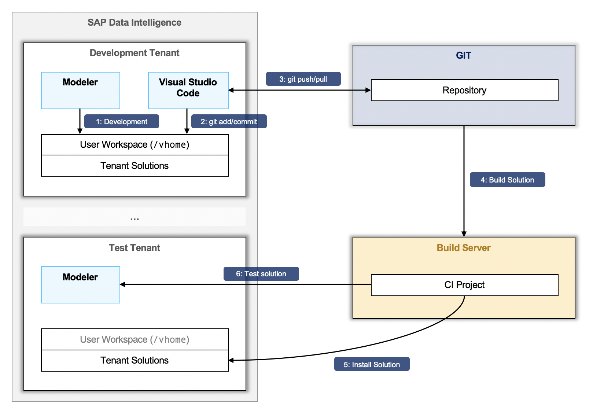

# DEPRECATED: Do not use this method for SAP Data Intelligence Git integration!
# INSTEAD: Use the SAP Data Intelligence [Git Terminal](https://help.sap.com/docs/SAP_DATA_INTELLIGENCE/1c1341f6911f4da5a35b191b40b426c8/5d7d9e25afb642ed9f4b21f0c62f9871.html?locale=en-US&version=Cloud).

----

# Git Integration and CI/CD Process with SAP Data Intelligence

In this project we describe a process to develop [SAP Data Intelligence (SAP DI)](https://www.sap.com/products/data-intelligence.html) solutions using Git and to build, test, and deploy them
using [Continuous Integration and Delivery (CI/CD)](https://en.wikipedia.org/wiki/Continuous_integration) tools.
The provided guides describe best practices and can be adapted to the specific
needs of your development environment.

The following guides and tools have been published for the following SAP DI versions and above:
  * **SAP Data Intelligence 3.0** (on-premise edition)
  * **SAP Data Intelligence DI:2003** (cloud edition)

## Overview

The environment for the Git workflow and the CI/CD process consists of the following systems and tools:

* **SAP Data Intelligence**
  * One or several development tenants
  * A single test tenant
  * The [System Management Command-Line Client (vctl)](https://help.sap.com/viewer/41b069490705457e9426b112a3f052bd/Cloud/en-US)
* **Git Repository** (e.g., on GitHub or GitHub for Enterprises) to keep the [solution artifacts tracked in Git](GitWorkflow.md)
* **Build Server** (e.g., [Jenkins](https://jenkins.io/)) to run the vctl commands of the CI/CD pipeline

The end-to-end development workflow can be summarized as follows:

1. **Development**: A developer will create/update/delete graphs, operators, or dockerfiles using the SAP Data Intelligence Pipeline Modeler. All changes are visible in the user workspace of SAP Data Intelligence (`/vhome`).
2. **Git Usage**: The developer is using the [VSCode application](vscode-app) to interact with the Git repository (i.e., `git add <graph-artifact>`, `git commit`).
3. **Git Push**: Once the developer has reached a working state, he pushes the changes to the repository
4. **Build Solution**: The build server listens to changes on a specified branch and triggers a new build job. The job will fetch the latest changes to the build server and build a solution package from the tracked project files.
5. **Install Solution**: The build server installs the solution on a configured test tenant.
6. **Test Solution**: The build server executes a configured test graph using the SAP Data Intelligence Pipeline instance on the test tenant.

## Get Started

To implement the Git workflow and the CI/CD process just follow the guides below:

1. Installation of the [VSCode Application](vscode-app/Readme.md)
2. Implementing a [Git Workflow](GitWorkflow.md) to develop solutions
3. Configuring a [CI/CD pipeline](CICD.md) to build, test, and deploy solutions.

## Disclaimer

This project is not part of the SAP Data Intelligence product. It provides best
practices to implement a Git workflow on development environments.

## Notes

Feel free to send us feedback and open bugs in case of problems. We will update
the guides as new SAP Data Intelligence versions are published.
