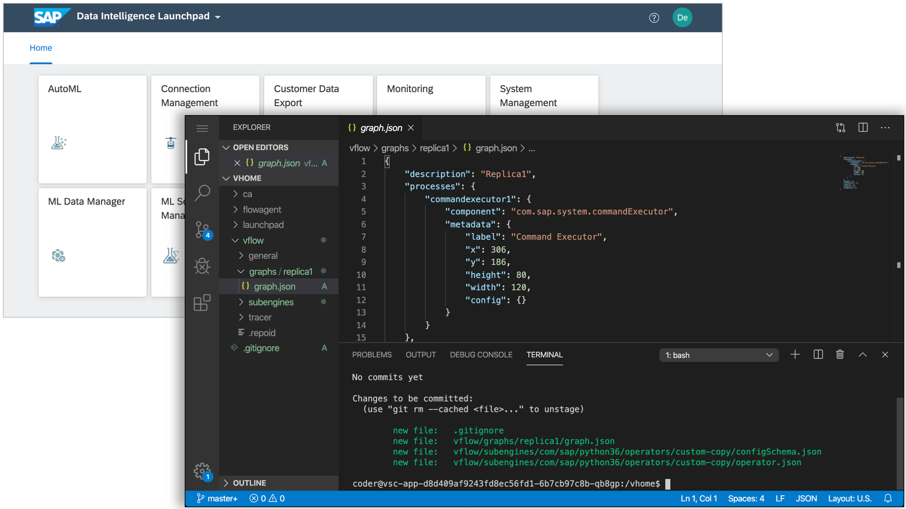

# VSCode Application for SAP Data Intelligence

The VSCode "Launchpad Application" is an example application to show how a terminal interface can be added to SAP Data Intelligence.
The application is based on the remote version of [Visual Studio Code](https://code.visualstudio.com/)
and makes it available as an application in [SAP Data Intelligence (SAP DI)](https://www.sap.com/products/data-intelligence.html).
The application provides the following capabilities:

* Access the SAP DI user workspace using a terminal interface.
* Provides a Git client to track files in the user workspace (e.g., graphs, operators) in a Git repository.
* For details about the development of solutions using Git see the following guide: [Git Workflow for SAP Data Intelligence](../Readme.md)



## Disclaimer

This application (docker image, application descriptor) is released under the
[SAP Sample Code License Agreement](../../LICENSE) and is not part of the SAP Data Intelligence 
shipment. Its main purpose is to simplify the tracking of development artefacts in a Git repository.
The application should only be installed on SAP DI tenants that are used for development and/or testing.

## Installation

### Pre-requisites

* The application is supported starting with:
  * **SAP Data Intelligence 3.0** (on-premise edition)
  * **SAP Data Intelligence DI:2003** (cloud edition)
* To install the application you will need to have `admin` permissions on the SAP DI tenant.
* The SAP DI tenant needs to be able to access the public docker image
[sapdi/vsc-app](https://hub.docker.com/r/sapdi/vsc-app). Otherwise, the image needs to be pushed to a private registry available to the SAP DI tenant and the solution package needs to be updated (see [Build Section](#Build) below)

### Add Solution to Tenant

1. Download the solution package [vscode-app.zip](vscode-app.zip) availabe in this project.
2. Install the solution as a layer to your tenant as described in the official [Manage Strategies](https://help.sap.com/viewer/ca509b7635484070a655738be408da63/Cloud/en-US/8bbc552fc0604792bb114d850391d739.html) documentation. The steps at-a-glance look like this:
    1. Log in as tenant administrator on your SAP DI tenant.
    2. Open the `System Manager` application.
    3. Go to `Tenant`, select `Solutions`, and click `+`.
    4. Choose the `vsc-app.zip` file in the file dialog and confirm.
    5. Go to the `Strategies` section and click `Edit`. **Note**: In case you are not able to edit the strategy (edit button does not exist) you need to login to the SAP DI system tenant and assign the solution to the strategy there.
    6. Add the newly added layer `vsc-app` to the strategy and click `save`.
    7. The VSCode application will now show up in the launchpad of all users.

### Build

In case the SAP DI tenant has no access to the internet the VSCode application will not work since it needs the public docker image [sapdi/vsc-app](https://hub.docker.com/r/sapdi/vsc-app). In this case, you need to push the image to a private registry that can be accessed from the SAP DI tenant first.

In the following we describe how to build the image and push it to the private registry. You can also just pull the public docker image and push it to the private registry directly.

1. Build the docker image on a machine with access to the internet:
```
docker build -t vsc-app:1.0 .
```
2. Tag the docker image and push it to the private registry (you can choose another tag name)
```
docker login
docker tag vsc-app:1.0 <YOUR-PRIVATE-REGISTRY>/vsc-app:1.0
docker push <YOUR-PRIVATE-REGISTRY>/vsc-app:1.0
```
4. Update the `image` parameter in the file `content/vsystem/apps/vsc-app.json` to match your docker image name:
```
...
"containers": [
  {
    "name": "vsc",
    "image": "<YOUR-PRIVATE-REGISTRY>/vsc-app:1.0",
    ...
```
5. Zip the solution into a solution package as follows:
```
rm -f vsc-app.zip
cd solution && zip -r ../vsc-app.zip manifest.json content/
```
6. Install the `vsc-app.zip` solution on the SAP DI tenant as explained in the previous section.

### Kubernetes Setup

* Make sure your Kubernetes Load Balancer is not timing out request after a short while (e.g., 30 seconds) since this will result in a continuous "reload" message in the VSCode application due to a necessary Web Socket connection. Proper configurations to increase the timeout to reasonable values like 30 minutes are described here:
  * [GKE Backend Config](https://cloud.google.com/kubernetes-engine/docs/concepts/backendconfig)
  * [AWS ELB Timeout Setting](https://aws.amazon.com/de/blogs/aws/elb-idle-timeout-control/)
  * [AKS LB Settings](https://docs.microsoft.com/en-us/azure/aks/load-balancer-standard)
* If it is not possible in your cluster to request external Load-Balancers then please make sure to add an internal-LB annotation to the service description in `content/vsystem/apps/vsc-app.json`. The annotation is Hyperscaler dependant and is documented in the official K8s documentation: [Internal load balancer](https://kubernetes.io/docs/concepts/services-networking/service/#internal-load-balancer).

The service should then look like the following example for AWS:
```
[...]
metadata:
    name: my-service
    annotations:
        service.beta.kubernetes.io/aws-load-balancer-internal: "true"
[...]
```
You might need to tag specific subnets so that K8s can use them as an IP pool for the internal load balancer.
For e.g. AWS this is the following:
```
Key: kubernetes.io/role/internal-elb
Value: 1
```

## Legal

Copyright (c) 2020 SAP SE or an SAP affiliate company. All rights reserved. 
This project is licensed under the Apache Software License, version 2.0 except as noted otherwise in the 
[LICENSE](https://github.com/SAP-samples/datahub-integration-examples/blob/master/LICENSE).

