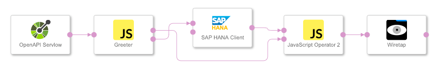

## Exposing HANA via an OpenAPI server ##

This sample graph exposes an SAP HANA database through an OpenAPI server operator. A table name can be provided and the content of the table will be given as result.

The graph was tested with Data Hub version 2.4.

**How to run**

1. Import the sample graph
2. Define a HANA connection in the Connection Management
3. Change the 'SAP HANA Client' operator in the graph to use that HANA connection
4. Start the graph
5. To verify, go to the browser and execute below URL:  
   `https://<vsystem-URL>/app/pipeline-modeler/openapi/service/samples/hanaServer/hana/{tablename}`
   
For example  
`https://myhostname.com/app/pipeline-modeler/openapi/service/samples/hanaServer/hana/m_databases`  
`https://myhostname.com/app/pipeline-modeler/openapi/service/samples/hanaServer/hana/sys.users`  
