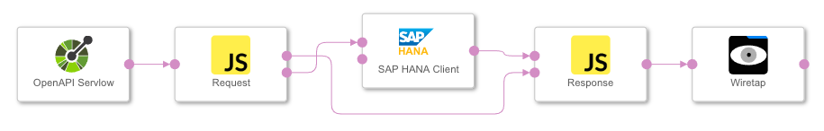

## Exposing HANA via an OpenAPI server ##

This sample graph exposes an SAP HANA database through an OpenAPI server operator. A table name can be provided and the content of the table will be given as result.

The graph was tested with Data Hub version 2.4.

## Requirements

Before you start using the example, please make sure that:

- You are familiar with the basic concepts of SAP Data Hub Modeling such Pipelines (Graphs), Operators and Dockerfiles.  For more information, you may refer to the Modeling Guide for SAP Data Hub that is available on the SAP Help Portal (https://help.sap.com/viewer/p/SAP_DATA_HUB).
- You are familiar with the basic concepts of Docker (https://docs.docker.com/get-started/) and Kubernetes (https://kubernetes.io/docs/concepts/overview/what-is-kubernetes/).

## Content
**Sample graph**
  - Demonstrates a workflow where a HANA table is exposed via OpenAPI Server operator. In this case, user can query table via GET request.

**How to run**

1. Import the sample graph
2. Define a HANA connection in the Connection Management
3. Change the 'SAP HANA Client' operator in the graph to use that HANA connection
4. Start the graph
5. To verify, go to the browser and execute below URL:  
   `https://<vsystem-URL>/app/pipeline-modeler/openapi/service/samples/hanaServer/hana/{tablename}`
   
For example  
`https://myhostname.com/app/pipeline-modeler/openapi/service/samples/hanaServer/hana/m_databases`  
`https://myhostname.com/app/pipeline-modeler/openapi/service/samples/hanaServer/hana/sys.users`  

**Additional information**

| Operator      | Source Code   |
| ------------- | ------------- |
| OpenAPI  | [swagger file](src/Additional/swagger.json)  |
| Request JS  | [Request Code](src/Additional/Request.js)  |
| Response JS  | [Response Code](src/Additional/Response.js)  |
