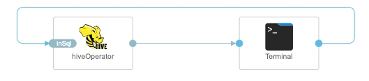
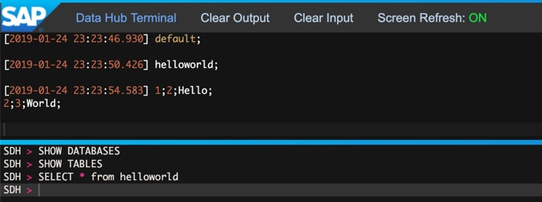
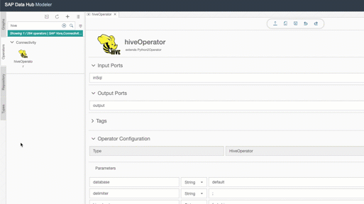

HiveOperator [(Source code)](https://github.com/SAP/datahub-integration-examples/blob/master/HiveOperator/src/vrep/vflow/subengines/com/sap/python27/operators/examples/HiveOperator/script.py)
------------
This operator provides functionality to query a Hive Metastore server using a HiveQL string and returns a response in the format of a delimited string.

The operator runs on a custom Docker images that extends the public docker image `python:3.6.4-slim-stretch` and uses the Kerberos client binary `krb5-user` as well as `libsasl2` for Ubuntu. The PyHive python module is developed and maintained by Dropbox: https://github.com/dropbox/PyHive

[(Graph source code)](https://github.com/SAP/datahub-integration-examples/blob/master/HiveOperator/src/vrep/vflow/graphs/HiveOperator_test/graph.json)

## Requirements

- A Hive Metastore server has been installed and configured, such as one hosted on Ambari Hortonworks or Cloudera.
- You are familiar with the basic concepts of SAP Data Intelligence Modeling such Pipelines (Graphs), Operators and Dockerfiles.  For more information, you may refer to the Modeling Guide for SAP Data Hub that is available on the SAP Help Portal (https://help.sap.com/viewer/aff95eebc2e04c44816e6ff0d21c3c88/).
- You are familiar with the basic concepts of Docker (https://docs.docker.com/get-started/) and Kubernetes (https://kubernetes.io/docs/concepts/overview/what-is-kubernetes/).

## Content
**1. Dockerfile**
  - Extends the SAP-delivered Dockerfile `python:3.6.4-slim-stretch`
  - Imports the python library `pyhive`
  - Install Kerberos client libraries

**2. Custom operator 'HiveOperator'**
  - Derived from Pythin3Operator
  - Uses image tags `python36:""`, `pyhive:pip3` and `tornado:5.0.2`
  - **input port `inSql` of type string:** expects a single HiveQL-compliant string without a semicolon
  - **output port `output` of type string:** outputs the response from the Hive Metastore server, columns are delimited by a comma (default) but can be overriden using the `delimiter` configuration parameter (See description below)

**3. Sample graph HiveOperator_test**
  - Provides an interactive terminal to query a Hive Metastore server and display the results. Note, the HiveOperator can only process one HiveQL statement at a time.

## How to run
  - Import [solution/HiveOperator-1.0.tgz](solution/HiveOperator-1.1.0.tgz) via `SAP Data Intelligence System Manager application` -> `Files` -> `Import Solution`
  - Run the `Graph` -> `examples.HiveOperator_test`

**Operator configuration parameters**

	database:                 Specify which database in Hive metastore to connect to
	delimiter:		  Used to separate columns in HiveOperator output e.g. 1.34;Hello;World;
	hive_hostname:		  Hostname or IP address to Hive Metastore server
	hive_port:		  Port used by Hive Metastore server
	http_mode:		  If hive.server2.transport.mode is set to http, set this parameter to true
	kerberos_enabled:	  If Hive cluster is kerberized set to true and read additional notes below
	kerberos_keytab_filename: The file name of the uploaded keytab file (case sensetive)
	kerberos_principal: 	  Kerberos principal used with uploaded keytab file
	kerberos_realm: 	  Kerberos realm used with principal and keytab file
	username: 		  Username for plain authentication
	password: 		  Password for plain authentication

**Kerberos configuration**
(Optional) Upload .keytab and krb5.conf file via the HiveOperator designer. These will be copied into the docker container at runtime. Remember to specify the kerberos realm and principal name in the operator's configuration section when designing your graph.

**Troubleshooting**

For detailed errors messages check the failing vflow pod's log.
Note: Bad HiveQL syntax will cause the graph to terminate. HiveQL statements must not include a semicolon.
