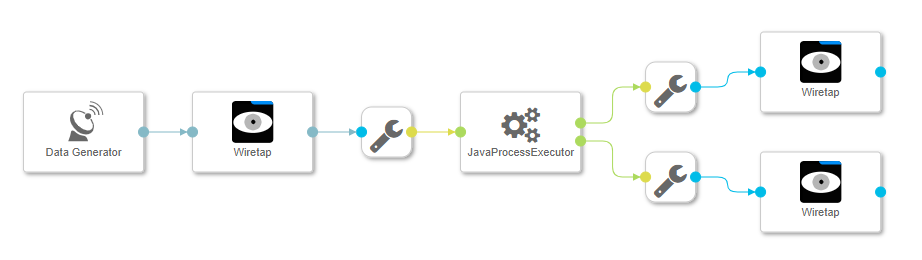

# Java Process Executor #
This example shows how to run a Java Application using a Process Executor Operator.

The functionality was tested with Data Hub version 2.4.



## Build

### Build example JavaApplication using Maven (https://maven.apache.org/)

```
$ mvn clean package -f src/JavaApplication/pom.xml
```

### Build SAP Data Hub Solution

```
$ tar -cvz --exclude='./JavaApplication' -f solution/JavaProcessExecutor.tgz -C src .
```

## Content  
**1. Dockerfile [src/vrep/vflow/dockerfiles/examples/JavaProcessExecutor/Dockerfile](src/vrep/vflow/dockerfiles/examples/JavaProcessExecutor/Dockerfile)**
  - Specifies the Docker Image that is used by the ProcessExecutor
  - The used Base Image provides the Java Runtime Environment required by the ProcessExecutor
  - provides the image tag `java` with version `11`

**2. Custom Operator  [src/vrep/vflow/operators/examples/JavaProcessExecutor/](src/vrep/vflow/operators/examples/JavaProcessExecutor/)**
  - Derived from 'ProcessExecutor'
  - Uses the image tag `java` with version `11`
  - Has one parameter `mode`
  - Runs the command `java -jar /vrep/vflow/operators/examples/JavaProcessExecutor/JavaApplication.jar ${mode}` 
 
**3. Sample graph [src/vrep/vflow/graphs/examples/JavaProcessExecutor/](src/vrep/vflow/graphs/examples/JavaProcessExecutor/)**
  - Demonstrates how to use the custom Process Executor to run a Java Application

## How to run
  - Import [solution/JavaProcessExecutor.tgz](solution/JavaProcessExecutor.tgz) via `SAP Data Hub System Management` -> `Files` -> `Import Solution`
  - Run the `Graph` -> `examples.JavaProcessExecutor`
