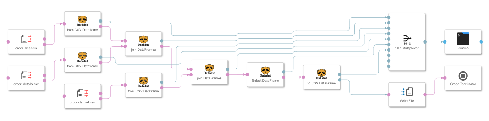

# Pandas DataFrame Operators
Are a set of operators that can be implemented on SAP Data Hub/SAP Data Intelligence. These operators 
help to create Pandas DataFrames from CSV-strings or byte-encoded data. 

Example graph with creating DataFrames, sampling, joining, selecting and creating CSV:

The list of operators are constantly growing and will never be complete. In any case it should provide you the idea how to develop quickly similar pandas operators that suits your requirements. At the end of the README.md you find a documention with common features and some practices of how it was developed. 

More on the pandas project and the benefits it provides to high-performance data structures and analysis you find at https://pandas.pydata.org.

## Requirements

In order to be able to deploy and run the examples, the following requirements need to be fulfilled:

- SAP Data Hub 2.3 or later installed on a supported [platform](https://support.sap.com/content/dam/launchpad/en_us/pam/pam-essentials/SAP_Data_Hub_2_PAM.pdf) or SAP Data Hub, [trial edition 2.3](https://blogs.sap.com/2018/04/26/sap-data-hub-trial-edition/)
- A docker-image with pandas package is available 

## Download and Installation
In the *solution*-folder you find the ready-to-import operators that will be stored under the path: 

- /files/vflow/subengines/com/sap/python36/operators

## Examples
In the github folder *example-graphs* you find an example how to use the operators.

## Known Issues

Currently there are no known issues with the operators but nonetheless although all operators come with test cases and the code has limited complexities there might be errors that are not discovered yet. Notes of failing cases are well-appreciated. 

## How to get support

If you need help or in case you found a bug please open a [Github Issue](https://github.com/SAP/datahub-integration-examples/issues).

## How to run
  - Import [solution/PandasDataFrameOperators-0.0.7.zip](solution/PandasDataFrameOperators-0.0.7.zip) via `SAP Data Hub System Management` -> `Files` -> `Import Solution`

## License

Copyright (c) 2019 SAP SE or an SAP affiliate company. All rights reserved.
This project is licensed under the SAP Sample Code License except as noted otherwise in the [LICENSE file](LICENSE).

## Documentation
Four basic operators are provided and a template for creating custom panda operators. 

* fromCSVDataFrame.py - creating DataFrame using a csv-string or byte-encoded csv-string
* toCSVDataFrame.py  - creating a csv-string for saving as a file
* joinDataFrames.py - joining 2 DataFrames
* selectDataFrame.py - selecting rows of columns based on values
* templateDataFrame.py - doing nothing but can be enhanced by own scripts
* ... 

### Local Development Support
To work with the IDE of your choice and to run unit tests, you may start the development locally and do the appropriate tests before deploying the scripts in a SAP Data Hub / SAP Data Intelligence cluster. For doing this for all scripts supporting features are provided. There is also a hint for a simulation of a pipeline. An example is given in the **pipeline.py** script. 

### Basic Architecture
The communication is based on **message.DataFrame** where the body is linked to the DataFrame and the attributes provides some basic information like

* number of columns
* number of rows
* index
* column names
* memory usage
* data types of columns

The ports of communincating between **DI_pands** operators are type **message.DataFrame** to ensure a test of connecting operators on modeler level. In addition in the script the type of the body (pandas.DataFrame) is tested as well. 

### Some common features 
#### Memory
Because memory usage for big data is critical, **fromCSV** supports to select columns and 
to downcast datatypes. Open is the implementation of datatype **category** to reduce the 
memory of the extremely memory demanding strings. 
It is assumed that all data processing with the pandas operators runs on the same pod. For crossing pods a streaming needs to be implemented that is still open. A simple workaround would be the saving of the results in an object store or a database and then reading it from other pods. 

#### Communication between operators
For the communication the data type **message** is used where 
* **attributes** contains a basic profile of the DataFrame i(e.g. name, last_operator, number of rows and columns, message usage, data types, column names, ...). 
* **body** of the message contains the byte-encoded DataFrame. 

The alternative of using a custom type was discarded because it is not supported within Python operators by providing and supporting the pre-defined structure. The only benefit is that in the Modeler the compatibility of the connections are checked. 

Within a Python operator you can access the attributes of the message as a dictionary where as the body stores the pointer to the DataFrame. 

Most of the di_pandas operators have 1 input dataport and 2 outputdata ports. The nomenclature is **DataFrameMsg** for the data message and **Info** for channeling infos to a terminal or a logging file for monitoring the graph behaviour while developing. 

### Operator Descriptions

#### fromCSVDataFrame
Creating a DataFrame with csv-data passed through inport. 

##### Input
**csv** (message) providing the string or byte-code of csv data structure. Operator tests the data type. 

##### Output
* **DataFrameMsg** -message- 
* **Info** -string-

##### Config
* **index_cols** -string-  the index of the DataFrame
* **separator** -string- separator of the csv data (default = ; )
* **error_bad_lines** -boolean- When True raises error on bad lines
* **use_columns** -string- list of column names that should be used. All other columns are dropped
* **limit_rows** -integer- limits the number of read rows. Useful for the development phase 
* **downcast_int** -boolean- downcasts the (default) int64 data type of columns to minimum possible based on the values in the column. CAUTION: if later in the pipeline process appended data needs types with bigger memory footprint, an error is raised
* **downcast_float** -boolean- downcasts the (default) float64 data type of columns to float32 if permitted by the values in the column. CAUTION: if later in the pipeline process appended data needs types with bigger memory footprint, an error is raised
* **df_name** -string- name of the DataFrame for monitoring or saving purpose. WARNING: the name 'DataFrame' is overwritten when a filename is passed in the attributes.  

#### toCSVDataFrame
Creates a csv-formatted data passed to outport as message with the csv-string as body. 

##### Input
* **DataFrame**

##### Output
* **CSVMsg** string formatted as csv. 
* **Info**

##### Config
* **write_index** -boolean- When True the index is saved as well
* **separator** -string- separator of the csv data (default = ; )

#### selectDataFrame
Selecting data records based on column data restrictions (= SELECT * FROM ... WHERE COLX = x AND ...) of numeric types and lists of data. 

##### Input
* **inDataFrame**

##### Output
* **outDataFrame**
* **Info**

##### Config
* **selection_num** -string- Selection criteria for numerical columns. Comparison operators: ['=', '>', '<', '!' or '!=' ]. Example: 'order_id < 100000'  

* **selection_list** -string- Inclusion or exclusion list of values for numerical and string column.  Comparison operators: ['=', '!' or '!=' ]. Example: 'trans_date = 2016-03-03, 2016-02-04 '  

#### joinDataFrame
Joining 2 DataFrames using either the indices of both or on specified columns. Setting the new index ist necessary. 

##### Input
* **leftDFMsg**
* **rightDFMsg**

##### Output
* **outDataFrame**
* **Info**

##### Config
* **how** -string-  "inner"
* **on_index** -boolean-- If true the 2 DataFrames are joined using the indices (not tested yet with multiple indices)
* **left_on** -string-  Name of column of leftDF that is joined with name of column of rightDF
* **right_on** -string-
* **new_indices** -string- New index or multiple indices for the joined DataFrame
* **drop_columns** -string- List of columns of the joined DataFrame that could be dropped. 

#### dropColumns
##### Input
* **inDataFrameMsg**

##### Output
* **outDataFrame**
* **Info**

##### Config#
* **drop_columns** 
	* *comma separated list of columns*: columns to drop
	* *NOT: comma separated list of columns*: drop all columns except columns in the list 
	* *ALL* : drop all columns and reset index - same as *NOT* without list. 

#### sampleDataFrame
##### Input
* **inDataFrameMsg**

##### Output
* **outDataFrame**
* **Info**

##### Config#
* **sample_size** -integer- size of sample
* **random_state** - integer- initializing random number generator
* **invariant_column** -string- Column that values should be kept and not split in a sample, e.g. all records of a customer should be in a sample, basically sampling over customers. Because not all the values of the invariant_columns have the same number of records the average is taken to approximate the sample_size. 
	

