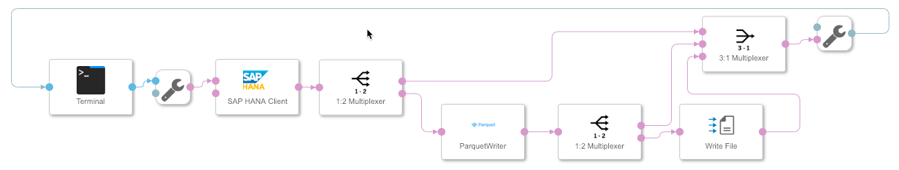
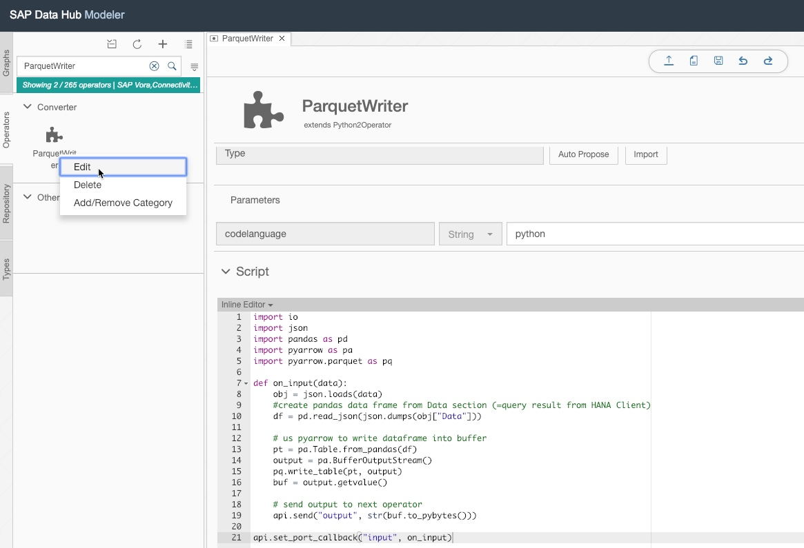

# ParquetWriter operator #
This custom operator creates a file in Parquet format from an input message. For more information on the Parquet format see https://parquet.apache.org/

It is based on Python 2.7 and was tested with Data Hub version 2.4.

## Requirements

Before you start using the example, please make sure that:

- You are familiar with the basic concepts of SAP Data Hub Modeling such Pipelines (Graphs), Operators and Dockerfiles.  For more information, you may refer to the Modeling Guide for SAP Data Hub that is available on the SAP Help Portal (https://help.sap.com/viewer/p/SAP_DATA_HUB).
- You are familiar with the basic concepts of Docker (https://docs.docker.com/get-started/) and Kubernetes (https://kubernetes.io/docs/concepts/overview/what-is-kubernetes/).

## Content
**1. Dockerfile 'Python2_pyArrow' ([Source code](src/ParquetWriter-1.0/vrep/vflow/dockerfiles/examples/Python2_pyArrow/Dockerfile))**
  - Extends the SAP-delivered Dockerfile com.sap.python27
  - imports Python libraries pyarrow and pandas
  - Uses image tags `pyarrow` and `python27`

**2. Custom operator 'ParquetWriter' ([Source code](src/ParquetWriter-1.0/vrep/vflow/subengines/com/sap/python27/operators/examples/ParquetWriter/parquet_pyarrow_upload.py))**
  - derived from 'Python2Operator'
  - Uses image tags `pyarrow` and `python27`
  - **input port `input` of Type message:** expects output message from 'Hana Client' (a Python list of Python dictioraries that present the result a SELECT against HANA)
  - **output port `output` of Type message:** produces a message with empty attributes and binary parquet file in body

**3. Sample graph 'ParquetWriter'**
  - Demonstrates a workflow where a HANA table is read and written into a parquet file using the custom ParquetWriter  operator
  
## How to run
  - Import [solution/ParquetWriter-1.0.tgz](solution/ParquetWriter-1.0.tgz) via `SAP Data Hub System Management` -> `Files` -> `Import Solution`
  - Define a HANA connection in the SAP Data Hub Connection Management
  - Open graph `ParquetWriter` and configure the `SAP HANA Client` operator to use the previously created HANA connection
  - Start the graph and open the 'Terminal' via right-click 'Open UI'
  - In the 'Terminal' prompt run a SQL against a HANA table
    - For testing use a SQL that returns a small amount of data:  
      `select top 2 ADMIN_GIVEN_PASSWORD, USER_NAME from sys.users;`
  - The Parquet file can be found in System Management -> Files -> My Workspace -> Directory /vflow 
    From there it can be downloaded via 'Right-click' -> 'Export File'

**Possible next steps:**
  - For larger amounts of data, modify the sample graph by removing the terminal operator and provide the input SQL to the HANA client programmatically. For example via a Python or JavaScript operator.
  - Re-configure the 'Write File' operator to write to a desired storage solution (cloud storage, HDFS)
  - If other data sources than 'HANA Client' are to be used the Python code in the ParquetWriter operator might need to be changed. You can do this by right clicking the ParquetWriter in the "Operator" tab on the left-hand side -> Edit.

